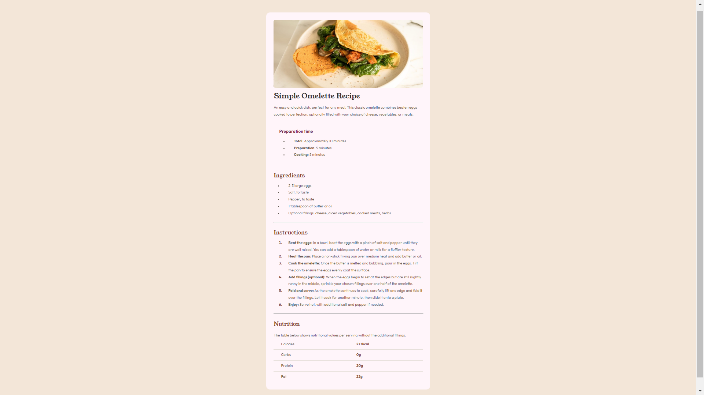

# Frontend Mentor - Recipe page solution

This is a solution to the [Recipe page challenge on Frontend Mentor](https://www.frontendmentor.io/challenges/recipe-page-KiTsR8QQKm). Frontend Mentor challenges help you improve your coding skills by building realistic projects.

## Table of contents

- [Overview](#overview)
  - [Screenshot](#screenshot)
  - [Links](#links)
- [Author](#author)

## Overview

This is my 4th challenge in Frontend Mentor.

This page features a recipe on how to make simple omelettes.

### Screenshot

### Links

- Solution URL: [https://www.frontendmentor.io/solutions/recipe-page-S-yx26xi5T](https://www.frontendmentor.io/solutions/recipe-page-S-yx26xi5T)
- Live Site URL: [https://8bitsoda.github.io/fm-04-recipe-page/](https://8bitsoda.github.io/fm-04-recipe-page/)

## Author

- Github - [Bazel](https://github.com/8BitSoda)
- Frontend Mentor - [8BitSoda](https://www.frontendmentor.io/profile/8BitSoda)